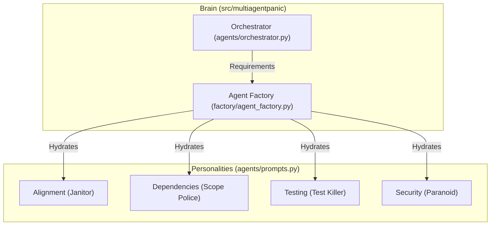

# AgentReview - The Source of Truth

**This file (`AGENTS.md`) is symlinked as `CLAUDE.md`. It is the canonical instruction set for ALL Intelligence (Biological and Artificial) working on this repository.**

## 1. Prime Directives

1.  **NO MOCKS**: We do not mock LLMs in integration tests. We have infinite ZAI tokens. Use them. Mocks create false confidence.
2.  **SECRETS ARE ENVIRONMENTAL**: No `.env` files. Secrets are injected by Bitwarden (`bws`) or available as global environment variables (`Z_AI_API_KEY`, `GITHUB_TOKEN`).
3.  **SPECIALIZED PERSONALITIES**: Agents are not generic.
    *   `TEST_KILLER`: Hostile to poor testing.
    *   `CODE_JANITOR`: Obsessed with cleanliness.
    *   `SCOPE_POLICE`: Rejects feature creep.
4.  **PYDANTIC EVERYTHING**: If it's not a Pydantic model, it doesn't exist.

## 2. Architecture & Mental Model

The system is a **LangGraph-orchestrated Multi-Agent System**.



### Key Components

| Component | File | Role |
|-----------|------|------|
| **Orchestrator** | `agents/orchestrator.py` | The CEO. Decides *which* agents run. Manages the graph state. |
| **Agent Factory** | `factory/agent_factory.py` | The HR Department. Spawns subgraphs for specific agents using templates. |
| **LLM Factory** | `factory/llm_factory.py` | The Recruiter. Instantiates LLMs with provider fallback. |
| **Settings** | `config/settings.py` | The Nervous System. Auto-detects keys from environment (`Z_AI_API_KEY`, etc.). |
| **CLI** | `cli.py` | The Mouth. Entry point for human interaction. |

### Prompt Files (Two Files, Different Purposes)

| File | Purpose | Used By |
|------|---------|---------|
| `agents/prompts.py` | **Personality prompts** - TEST_KILLER, CODE_JANITOR, SCOPE_POLICE, DOCS_EDITOR | `create_jit_agent()` in `agents/core.py` |
| `factory/prompts.py` | **Structured templates** - REVIEW_AGENT_TEMPLATES, CONTEXT_AGENT_TEMPLATES | `AgentFactory` methods |

The personality prompts define *how* an agent thinks. The structured templates define *what* tools and iterations an agent has.

## 3. Workflow & Commands

### Development Loop

```bash
# 1. Install (editable mode)
pip install -e ".[dev]"

# 2. Run ONE real review (The Golden Path)
# This uses --local-file to simulate a PR diff without needing GitHub API calls yet
python -m multiagentpanic review --repo test/repo --pr 1 --local-file src/multiagentpanic/agents/prompts.py

# 3. Validation
# Runs the live integration test. IF THIS FAILS, YOU ARE BLOCKED.
pytest tests/integration/test_01_e2e_simple_review.py -v
```

### Git Workflow

We use a stacked PR workflow (conceptual).
- **feat**: New capabilities
- **fix**: Bug corrections
- **docs**: Documentation updates
- **refactor**: Code change, no behavior change

## 4. Environment & Secrets

**WE DO NOT USE `.env` FILES.**

The environment is pre-seeded with keys. `settings.py` is smart enough to find them:
- `Z_AI_API_KEY` -> `llm.openai_api_key`
- `GITHUB_TOKEN` -> `workflow.github_token`
- `EXA_API_KEY` -> `search.exa_api_key`

If `get_settings()` fails, checking the environment (`env`) is the first debugging step.

## 5. Coding Standards for Agents

*   **Imports**: Absolute imports only (`from multiagentpanic.x import y`).
*   **Types**: strict `mypy` compliance. Use `typing.Optional`, `typing.List`, etc.
*   **Async**: The core graph execution is async.
*   **Error Handling**: Fail fast, but handled. The Orchestrator should capture agent failures and report them, not crash.

## 6. Current State (v0.2 Alpha)

*   [x] **Live Execution**: Works.
*   [x] **Prompt Integration**: Specialized prompts are live.
*   [x] **Mock Removal**: `graph.py` deleted. `orchestrator.py` uses real results.
*   [x] **Factory Modularization**: `llm_factory.py` and `prompts.py` extracted (Issue #15).
*   [x] **MCP Resource Cleanup**: Proper close() and atexit handling (Issue #23).
*   [ ] **Database**: Postgres integration is stubbed.
*   [ ] **MCP**: Tool servers are defined but not auto-started by python code yet.
*   [ ] **Stacked PR Agent**: Vision documented, implementation pending.

*Last Updated: 2025-12-27*

## 7. Archived Branches

### `archive/experimental-modal-v1` (Tag)

**Purpose**: Research branch exploring Modal.com serverless execution for offloading compute.

**Status**: Key patterns have been merged to main:
- ✅ `llm_factory.py` - Clean LLM creation with provider detection and retry logic
- ✅ `factory/prompts.py` - Agent template definitions extracted from factory
- ⏳ `agents/context.py` - ContextGatherer for async rate limiting (not yet merged)

**NOT to be merged directly** - Contains Modal-specific changes that remove database logic needed for cross-PR learning.

**Related Issue**: #15 (CLOSED - factory modularization complete)

---

## Personal Development Notes

This documentation serves as your personal knowledge base for the AgentReview system. Key points for future reference:

### Current Architecture Status (v0.1 Alpha)

**Live and Working:**
- ✅ Multi-agent orchestration via LangGraph
- ✅ Specialized agent personalities (Test Killer, Code Janitor, Scope Police, etc.)
- ✅ Real LLM integration (no mocking in tests)
- ✅ Pydantic-based configuration and state management
- ✅ Dynamic agent creation via factory pattern

**In Development:**
- 🔄 MCP tool integration (proposal complete, implementation in progress)
- 🔄 PostgreSQL checkpointing (infrastructure ready, implementation needed)
- 🔄 Observability stack (configuration complete, integration needed)

### Personal Development Workflow

1. **Daily Development**: Use the "Golden Path" command for testing
2. **Personality Tweaks**: Modify prompts in `agents/prompts.py` (TEST_KILLER, etc.)
3. **Template Changes**: Modify structured templates in `factory/prompts.py`
4. **Architecture Changes**: Update this document and related architecture docs
5. **Debugging**: Refer to `docs/guides/TROUBLESHOOTING.md`
6. **Stacked PRs**: Use Graphite (`gt`) - see `docs/guides/GRAPHITE.md`

### Key Decisions for Future Reference

- **No .env files**: All secrets via environment variables or Bitwarden
- **Real LLM calls**: Integration tests use actual API calls (budget-conscious)
- **Type safety first**: Pydantic models for all configuration and state
- **Factory pattern**: Dynamic agent creation enables flexibility
- **Solo-optimized**: Documentation and workflows designed for single developer
