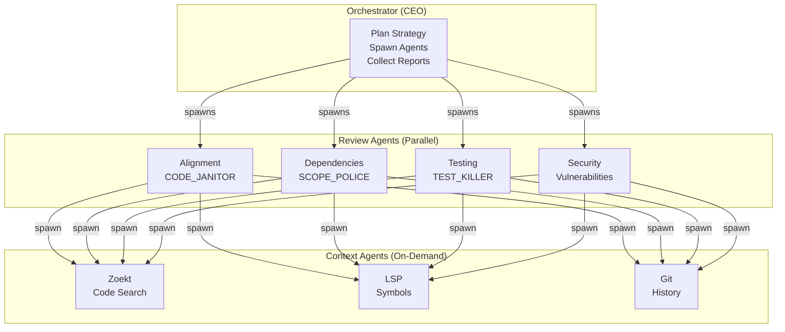

# AgentReview

Multi-agent PR review system built on LangGraph. Orchestrates specialized AI agents to provide comprehensive code reviews.

## Architecture



## Quick Start

```bash
# Install
pip install -e ".[dev]"

# Run a review
python -m multiagentpanic review --repo owner/repo --pr 123 --local-file path/to/file.py

# Run tests (uses real LLM calls)
pytest tests/integration/
```

> **Secrets**: API keys auto-detected from environment (`Z_AI_API_KEY`, `GITHUB_TOKEN`, etc.)

## Project Structure

```
src/multiagentpanic/
├── agents/
│   ├── orchestrator.py    # Main orchestrator (PRReviewOrchestrator)
│   ├── prompts.py         # Specialized agent prompts
│   └── workflow_agent.py  # Singleton CI/testing agent
├── factory/
│   ├── agent_factory.py   # Dynamic agent creation, REVIEW_AGENT_TEMPLATES
│   └── model_pools.py     # Model selection (simple/advanced)
├── config/
│   └── settings.py        # Pydantic settings, auto-detects env vars
├── domain/
│   └── schemas.py         # State models (PRReviewState, etc.)
├── cli.py                 # CLI entry point
└── tools/
    └── mcp_tools.py       # MCP tool integration
```

## Tech Stack

- **LangGraph** - Agent orchestration
- **Pydantic 2.9+** - Type safety, settings, state models
- **MCP** - Tool integration (Zoekt, LSP, Git)

## Key Features

- **Specialized prompts**: Each agent has a distinct review personality (hostile test killer, scope police, etc.)
- **Live testing**: Integration tests use real LLM calls (no mocking)
- **Auto-detection**: Settings detect API keys from environment automatically
- **Dynamic agents**: Review agents created from templates, not hardcoded

## Documentation

See [AGENTS.md](./AGENTS.md) for complete AI agent instructions.

## License

MIT
