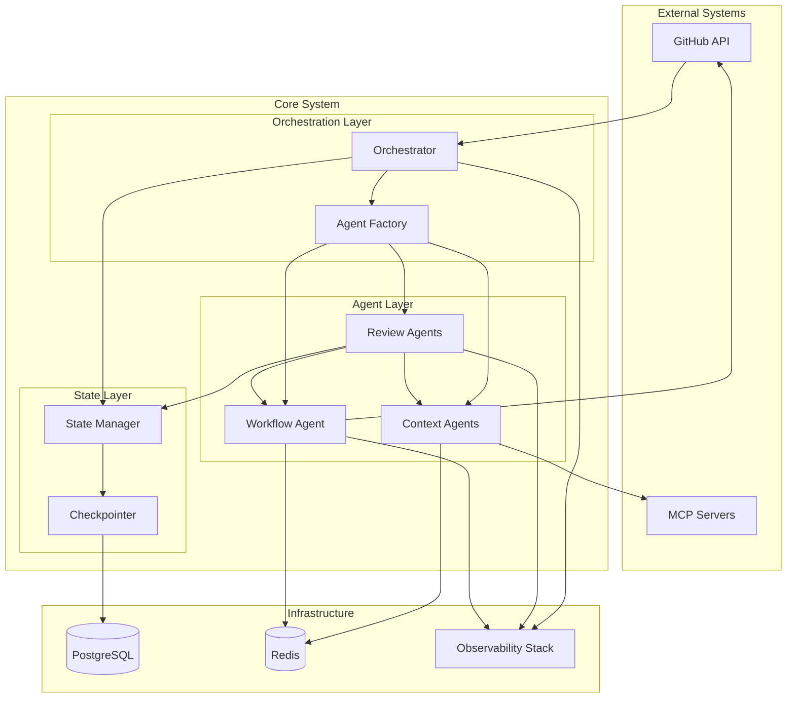

# Architecture Overview

Multi-agent PR review system using LangGraph for orchestration.

## System Diagram



## Agent Hierarchy

| Role | Agent | Description |
|------|-------|-------------|
| CEO | Orchestrator | Plans strategy, spawns agents, manages rounds |
| Senior Engineers | Review Agents (4) | Alignment, Dependencies, Testing, Security |
| Junior Engineers | Context Agents (3) | Zoekt search, LSP symbols, Git history |
| DevOps | Workflow Agent | CI runner, test executor (singleton) |

## Multi-Round Workflow

1. **Round 1: Initial Review** - All review agents analyze PR
2. **Round 2: Heal** - Address findings from round 1
3. **Round 3: Deep Heal** - Complex issues requiring multiple passes

## Architecture Documents

| Document | Description |
|----------|-------------|
| [System Design](architecture/system-design.md) | Agent hierarchy, orchestration patterns, design decisions |
| [Agent Factory](architecture/agent-factory.md) | Factory pattern, model pools, dynamic composition |
| [State Management](architecture/state-management.md) | Pydantic models, checkpointing, caching |

## Domain Documentation

Domain docs mirror code structure:

- [`docs/domains/agents/`](domains/agents/) - Agent implementations
  - [`orchestrator/`](domains/agents/orchestrator/) - Main orchestrator
  - [`workflow/`](domains/agents/workflow/) - Workflow agent
- [`docs/domains/factory/`](domains/factory/) - Agent factory and templates
- [`docs/domains/state/`](domains/state/) - State management
- [`docs/domains/observability/`](domains/observability/) - Metrics & tracing

**Note:** Review agents (alignment, dependencies, testing, security) and context agents 
(zoekt, lsp, git) are dynamically generated from templates defined in `factory/agent_factory.py`. 
This design pattern reduces code duplication and allows for flexible agent composition.

## Guides

| Guide | Description |
|-------|-------------|
| [Configuration](guides/configuration.md) | Settings, env vars, setup |
| [Testing](guides/testing.md) | Test strategy, integration tests |
| [Observability](guides/observability.md) | Langfuse, Prometheus, Grafana |
| [Troubleshooting](guides/troubleshooting.md) | Debugging guide, common issues, personal notes |

## Personal Development Context

This is a **solo development project** designed for personal use and experimentation. Documentation is optimized for:
- Single developer workflow and maintenance
- Personal knowledge management and future reference
- Experimentation and learning with LangGraph multi-agent patterns
- No team onboarding or production deployment requirements

## Quick Reference

**Most Used Commands:**
```bash
# Daily development workflow
pip install -e ".[dev]"
python -m multiagentpanic review --repo test/repo --pr 1 --local-file src/multiagentpanic/agents/prompts.py
pytest tests/integration/test_01_e2e_simple_review.py -v

# Troubleshooting
python -c "from multiagentpanic.config.settings import get_settings; print(get_settings().model_dump())"
```
