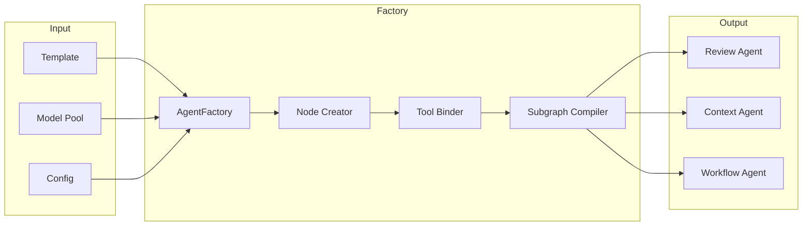

# Agent Factory

Dynamic agent composition system using templates, model pools, and runtime configuration. The factory enables flexible agent creation without hardcoding model or tool combinations.

---

## Table of Contents

- [Factory Pattern Overview](#factory-pattern-overview)
- [Agent Templates](#agent-templates)
- [Model Pool System](#model-pool-system)
- [Dynamic Node Creation](#dynamic-node-creation)
- [Tool Integration](#tool-integration)
- [Subgraph Compilation](#subgraph-compilation)

---
## Composable Agent Architecture

The system uses a **Composable Agent** model. An agent is defined by a collection of **Tags** (Model Tiers) which determine its capabilities.

### Composition Model
**Agent = Tags + Template**

- **Tags** (e.g., `expensive_coding`, `cheap_tool_use`): Define the **Infrastructure** (LLM Model, Cost Budget, Performance Profile).
- **Template**: Defines the **Personality** (System Prompt, Tools, Specific Instructions).

This separation allows us to tune the "brain" (Model Pool) independently of the "job" (Prompt).

### Tags & Capabilities
| Tag (Model Pool) | Purpose | Typical Model |
|------------------|---------|---------------|
| `high_coding` | Complex analysis, security audits | `glm-4.6`, `sonnet-3.5` |
| `low_coding` | Simple refactors, dependency checks | `gpt-4o-mini` |
| `reasoning` | Planning, orchestration | `o1-preview`, `deepseek-reasoner` |
| `tool_use` | Context gathering (search, git) | `claude-3-5-sonnet` |

---

## Factory Pattern Overview



See [Factory Domain Documentation](../domains/factory/fac-overview.md) for implementation details.

---

## Agent Templates

Templates define agent structure without binding to specific models or tools.

### Review Agent Templates

| Agent | Model Pool | Tools |
|-------|-----------|-------|
| Alignment | expensive_coding | LSP, Git |
| Dependencies | cheap_coding | Zoekt, package registries |
| Testing | expensive_coding | Zoekt, CI results |
| Security | reasoning | Zoekt, secret scanner, vuln DB |

### Context Agent Templates

| Agent | Model Pool | Tools |
|-------|-----------|-------|
| Zoekt | cheap_coding | MCP Zoekt search |
| LSP | cheap_coding | MCP LSP definition/references |
| Git | cheap_coding | MCP Git blame/log |

---

## Model Pool System

### Pool Definitions

```python
MODEL_POOLS = {
    "cheap_coding": ["claude-3-haiku", "gpt-4o-mini"],
    "expensive_coding": ["claude-3-5-sonnet", "gpt-4-turbo"],
    "reasoning": ["o1-preview", "claude-3-opus"],
}
```

### Selection Strategies

- **FIXED**: Always use first model (simple mode)
- **RANDOM**: Random selection
- **ROUND_ROBIN**: Rotate through models
- **LEAST_COST**: Select cheapest available
- **BEST_AVAILABLE**: Select best non-rate-limited (advanced mode)

---

## Tool Integration

Tools are bound via MCP (Model Context Protocol):

```python
tools = ["mcp_zoekt_search", "mcp_lsp_definition", "mcp_git_blame"]
```

See [Configuration Guide](../guides/configuration.md) for MCP server setup.

---

## Subgraph Compilation

The factory compiles templates into executable LangGraph subgraphs:

1. Get template for agent type
2. Select model from pool
3. Bind tools from MCP registry
4. Build nodes with retry/tracing wrappers
5. Compile graph with optional checkpointer

Review agents get checkpointing; context agents don't (stateless).
