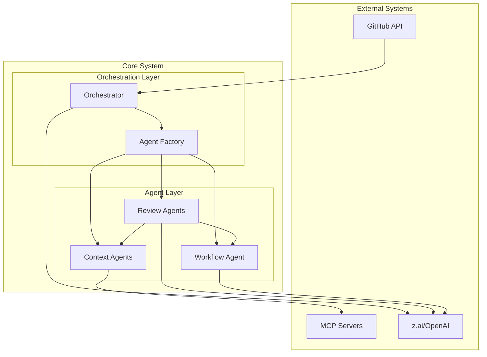

# System Design

Complete architecture documentation for the multi-agent PR review system, covering agent hierarchy, orchestration patterns, and design decisions.

---

## Table of Contents

- [System Overview](#system-overview)
- [Agent Hierarchy](#agent-hierarchy)
- [Design Decisions](#design-decisions)
- [State Management](#state-management)

---

## System Overview

The system processes PRs through a hierarchical agent structure:

1. **Orchestrator** (`agents/orchestrator.py`): Receives PR events and plans the review strategy.
2. **Agent Factory** (`factory/agent_factory.py`): Creates specialized agents from templates.
3. **Review Agents** (`agents/prompts.py`): Analyze code with specialized personalities:
    - **Alignment**: Check for design coherence (`CODE_JANITOR_AGENT_PROMPT`)
    - **Dependencies**: Check for bloat (`SCOPE_POLICE_AGENT_PROMPT`)
    - **Testing**: Check for coverage (`TEST_KILLER_AGENT_PROMPT`)
    - **Security**: Check for vulnerabilities
4. **Context Agents** (`agents/context/`): Gather supporting information via MCP.
5. **Workflow Agent** (`agents/workflow_agent.py`): Handles CI/tests.

---

## Agent Hierarchy

| Role | Agent | Persistence | Model Source |
|------|-------|-------------|------------|
| CEO | Orchestrator | Checkpointed | `settings.model_tier` |
| Senior Engineers | Review Agents (4) | Checkpointed | `agent_factory.py` templates |
| Junior Engineers | Context Agents (3) | Stateless | fast models |

## Design Decisions

### 1. No Mocks in Integration Tests
We deliberately avoid mocking LLM calls in integration tests (see `tests/integration/test_01_e2e_simple_review.py`).
- **Rationale**: Mocks drift from reality. With low-cost/high-availability models (z.ai), live testing is superior.
- **Implementation**: Tests use `load_env()` to pick up real API keys and run the actual LangGraph executable.

### 2. Environmental Secrets
We shun `.env` files in production/CI.
- **Rationale**: Security risk to have secrets on disk.
- **Implementation**: `config/settings.py` auto-detects standard environment variables (`Z_AI_API_KEY`, `GITHUB_TOKEN`) and maps them to internal settings.

### 3. Specialized Prompts
We define agent behavior via "personalities" rather than generic instructions.
- **Rationale**: Agents perform better when given a specific persona (e.g., "hostile test killer") rather than a generic "review this code" instruction.
- **Implementation**: `src/multiagentpanic/agents/prompts.py` contains the raw system prompts.

## State Management

We use **Pydantic** for rigorous state definition.

- **`PRReviewState`**: The global state passed through the graph.
- **`ReviewAgentVerdict`**: A structured output from each review agent, guaranteeing consistent reporting.
- **`PRMetadata`**: Immutable facts about the PR.

See `src/multiagentpanic/domain/schemas.py` for definitions.
