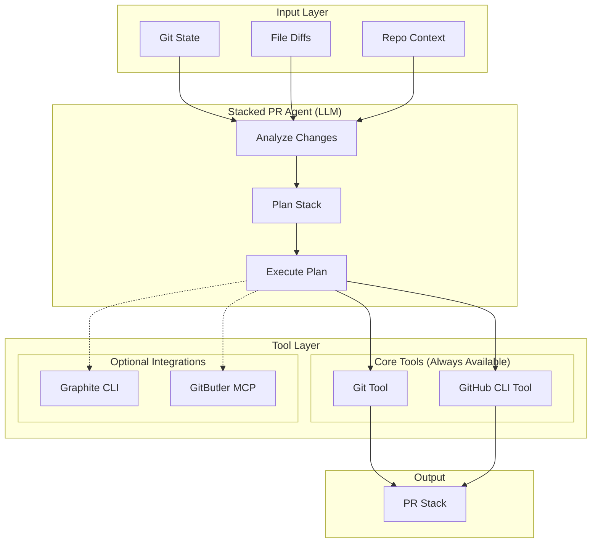
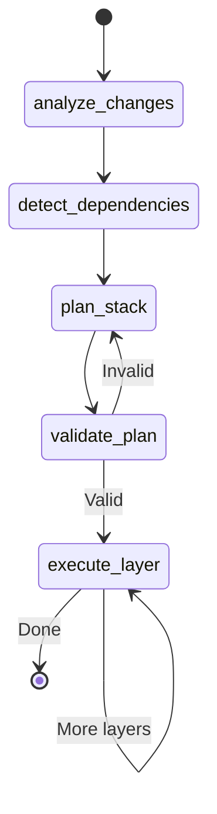

# Stacked PR Agent

An LLM-powered agent that analyzes uncommitted changes and creates stacked pull requests using composable tools and intelligent reasoning.

## Vision

The Stacked PR Agent embodies the core AgentReview philosophy: **LLM reasoning + composable tools**, not rigid scripts. Unlike traditional automation that relies on pattern matching, this agent uses language model reasoning to:

1. **Understand change semantics** - Not just file paths, but what the changes mean
2. **Plan optimal stacking** - Consider dependencies, review complexity, and merge order
3. **Adapt to context** - Work with or without external tools (Graphite, GitButler)
4. **Collaborate** - Integrate with review agents for impact analysis

---

## Architecture



---

## Agent Design

### State Schema

```python
class StackedPRState(BaseModel):
    """State for the Stacked PR Agent"""

    # Input
    changed_files: List[FileChange]
    diff_content: Dict[str, str]  # path -> diff
    repo_context: RepoContext

    # Analysis
    change_analysis: Optional[ChangeAnalysis] = None
    dependency_graph: Optional[Dict[str, List[str]]] = None

    # Planning
    stack_plan: Optional[StackPlan] = None
    reasoning: List[str] = Field(default_factory=list)

    # Execution
    created_prs: List[PRInfo] = Field(default_factory=list)
    execution_log: List[str] = Field(default_factory=list)

    # Tool availability
    graphite_available: bool = False
    gitbutler_available: bool = False
```

### Agent Nodes

| Node | Purpose | Tools Used |
|------|---------|------------|
| `analyze_changes` | Understand what each change does semantically | `git_diff`, `read_file` |
| `detect_dependencies` | Find inter-file dependencies | `lsp_references`, `grep` |
| `plan_stack` | Create optimal stack ordering | None (pure reasoning) |
| `validate_plan` | Check for conflicts, circular deps | `git_status` |
| `execute_layer` | Create branch, commit, push, PR | `git_*`, `gh_*`, optionally `graphite_*` |

### Workflow Graph



---

## Tool Definitions

### Core Tools (Always Available)

These tools wrap git and GitHub CLI operations, making them callable by the LLM:

```python
@tool
async def git_status(repo_path: str = ".") -> Dict[str, Any]:
    """Get current git status including changed files."""
    ...

@tool
async def git_diff(file_path: Optional[str] = None) -> str:
    """Get diff for specific file or all changes."""
    ...

@tool
async def git_create_branch(name: str, base: Optional[str] = None) -> bool:
    """Create a new branch, optionally from a base."""
    ...

@tool
async def git_commit(message: str, files: List[str]) -> bool:
    """Stage files and create a commit."""
    ...

@tool
async def gh_create_pr(title: str, body: str, base: str, head: str) -> Optional[int]:
    """Create a pull request, return PR number."""
    ...

@tool
async def gh_enable_auto_merge(pr_number: int, method: str = "squash") -> bool:
    """Enable auto-merge on a PR."""
    ...
```

### Optional: Graphite Integration

When Graphite CLI (`gt`) is available, these additional tools become accessible:

```python
@tool
async def graphite_create_stack(plan: StackPlan) -> List[int]:
    """Use Graphite to create an entire stack at once."""
    # Graphite handles branch management automatically
    ...

@tool
async def graphite_sync() -> bool:
    """Sync local stack with remote."""
    ...

@tool
async def graphite_submit() -> List[str]:
    """Submit all stacked branches as PRs."""
    ...
```

### Optional: GitButler Integration

When GitButler MCP server is available:

```python
@tool
async def gitbutler_analyze_changes() -> List[VirtualBranch]:
    """Let GitButler analyze and group changes into virtual branches."""
    ...

@tool
async def gitbutler_commit_branch(branch_id: str) -> bool:
    """Commit a GitButler virtual branch."""
    ...
```

---

## Prompts

### System Prompt

```
You are the Stacked PR Agent. Your job is to analyze uncommitted changes
and create a well-organized stack of pull requests.

## Principles

1. **Semantic Understanding**: Don't just look at file paths. Read the diffs
   and understand what each change does.

2. **Logical Grouping**: Group changes that are conceptually related, even if
   they touch different parts of the codebase.

3. **Dependency Ordering**: Base layers should not depend on upper layers.
   If A imports from B, A should be in a higher layer than B.

4. **Review Optimization**: Each PR should be reviewable in isolation.
   Aim for 200-400 lines per PR when possible.

5. **Conventional Commits**: Use conventional commit prefixes
   (feat, fix, refactor, docs, test, chore).

## Available Tools

You have access to git and GitHub tools. Use them to:
- Analyze the current state
- Create branches and commits
- Submit pull requests

{graphite_section}
{gitbutler_section}

## Output

After analysis, output a StackPlan with ordered layers. Each layer should have:
- name: Branch name (e.g., "feat/add-user-auth")
- title: PR title with conventional commit prefix
- body: PR description explaining the changes
- files: List of files in this layer
- depends_on: Name of the layer this depends on (or null for base)
```

### Analysis Prompt

```
Analyze these changes and categorize them semantically:

{diff_content}

For each logical group, explain:
1. What the changes accomplish
2. Why they belong together
3. What they depend on (if anything)

Think step by step about the relationships between changes.
```

---

## Change Categories

The agent uses semantic understanding, but these categories provide a starting vocabulary:

| Category | Description | Example Files |
|----------|-------------|---------------|
| `core` | Schemas, state, configuration | `domain/schemas.py`, `config/` |
| `infrastructure` | Factory, model pools, providers | `factory/`, `tools/mcp_*.py` |
| `agents` | Agent implementations | `agents/*.py` |
| `tools` | MCP tools, utilities | `tools/*.py` |
| `observability` | Metrics, tracing, logging | `observability/`, `prometheus/` |
| `tests` | Unit and integration tests | `tests/` |
| `docs` | Documentation | `docs/`, `*.md` |
| `config` | Project configuration | `pyproject.toml`, `uv.lock` |

**Note**: The LLM may identify categories not in this list based on semantic analysis.

---

## Usage Examples

### Basic Usage (No External Tools)

```python
from multiagentpanic.agents.stacked_pr import create_stacked_pr_agent

# Create agent with just git/gh tools
agent = create_stacked_pr_agent(model_selector)

# Analyze and plan
state = await agent.ainvoke({
    "repo_path": ".",
    "base_branch": "main"
})

# Review plan
print(f"Proposed stack: {len(state['stack_plan'].layers)} layers")
for layer in state['stack_plan'].layers:
    print(f"  - {layer.title} ({len(layer.files)} files)")

# Execute
await agent.ainvoke({**state, "execute": True})
```

### With Graphite

```python
# Graphite is auto-detected if `gt` is in PATH
agent = create_stacked_pr_agent(model_selector)

# Agent will prefer Graphite tools when available
state = await agent.ainvoke({"repo_path": "."})

# If Graphite is available, uses `gt stack submit`
# Otherwise, falls back to manual git/gh commands
```

### Dry Run

```python
state = await agent.ainvoke({
    "repo_path": ".",
    "dry_run": True  # Plan only, no execution
})

# Inspect the plan
print(state["reasoning"])  # LLM's analysis
print(state["stack_plan"])  # Proposed stack
```

---

## Integration with Review Agents

The Stacked PR Agent can collaborate with review agents for pre-submission analysis:

```python
# After planning, before execution
stack_plan = state["stack_plan"]

for layer in stack_plan.layers:
    # Run quick review on each layer
    review_state = await security_agent.ainvoke({
        "files": layer.files,
        "diff": get_diff_for_files(layer.files)
    })

    if review_state["verdict"]["severity"] == "high":
        # Flag this layer for human review
        layer.needs_review = True
```

---

## Configuration

### Settings

```python
class StackedPRSettings(BaseModel):
    """Configuration for Stacked PR Agent"""

    # Tool preferences
    prefer_graphite: bool = True  # Use Graphite if available
    prefer_gitbutler: bool = False  # Use GitButler if available

    # Stack parameters
    max_files_per_layer: int = 20
    max_lines_per_layer: int = 500

    # Commit style
    conventional_commits: bool = True
    include_scope: bool = True  # feat(scope): message

    # PR behavior
    auto_merge: bool = True
    merge_method: str = "squash"  # squash, merge, rebase
    delete_branch_after_merge: bool = True
```

### Environment Variables

| Variable | Description | Default |
|----------|-------------|---------|
| `GRAPHITE_CLI_PATH` | Path to Graphite CLI | Auto-detect |
| `GITBUTLER_MCP_URL` | GitButler MCP server URL | None |
| `STACKED_PR_DRY_RUN` | Default to dry-run mode | `false` |

---

## Graphite Integration Guide

Graphite is a CLI tool for managing stacked PRs. When available, it simplifies the workflow significantly.

### Installation

```bash
# Install Graphite CLI
npm install -g @withgraphite/graphite-cli

# Authenticate
gt auth

# Initialize in repo
gt init
```

### Key Commands

| Command | Description |
|---------|-------------|
| `gt create <name>` | Create a new branch in the stack |
| `gt modify` | Amend current branch |
| `gt stack` | View current stack |
| `gt sync` | Sync with remote (rebase) |
| `gt submit` | Submit all branches as PRs |
| `gt merge` | Merge approved PRs |

### How Agent Uses Graphite

When Graphite is detected, the agent:

1. **Prefers `gt create`** over manual branch creation
2. **Uses `gt submit`** to create all PRs at once with proper dependencies
3. **Leverages `gt sync`** for keeping stack up-to-date
4. **Falls back gracefully** if Graphite commands fail

### Troubleshooting Graphite

| Issue | Solution |
|-------|----------|
| `gt: command not found` | Ensure npm global bin is in PATH |
| `Not authenticated` | Run `gt auth` and follow prompts |
| `Not a Graphite repo` | Run `gt init` in repo root |
| `Stack out of sync` | Run `gt sync --force` |
| `Merge conflicts` | Resolve manually, then `gt continue` |

---

## Migration from Script-Based Agent

The previous `stacked_pr_agent.py` was a Python script using subprocess. To migrate:

### What Changes

| Old (Script) | New (LLM Agent) |
|--------------|-----------------|
| `subprocess.run(["git", ...])` | `git_tool.invoke(...)` |
| Pattern-based categorization | LLM semantic analysis |
| Fixed layer ordering | Dynamic based on dependencies |
| Hardcoded templates | LLM-generated descriptions |

### What Stays

The core concepts remain valid:
- `ChangeCategory` enum (as vocabulary, not rigid rules)
- `StackLayer` and `StackPlan` dataclasses
- Layer ordering principles (deps before dependents)
- PR body structure with stack visualization

---

## Future Enhancements

1. **Review Agent Integration**: Pre-submission security/quality checks
2. **CI Integration**: Wait for CI before stacking next layer
3. **Conflict Resolution**: LLM-assisted merge conflict resolution
4. **Stack Visualization**: Rich terminal UI for stack status
5. **Undo/Rollback**: Safely unwind a partially-created stack
