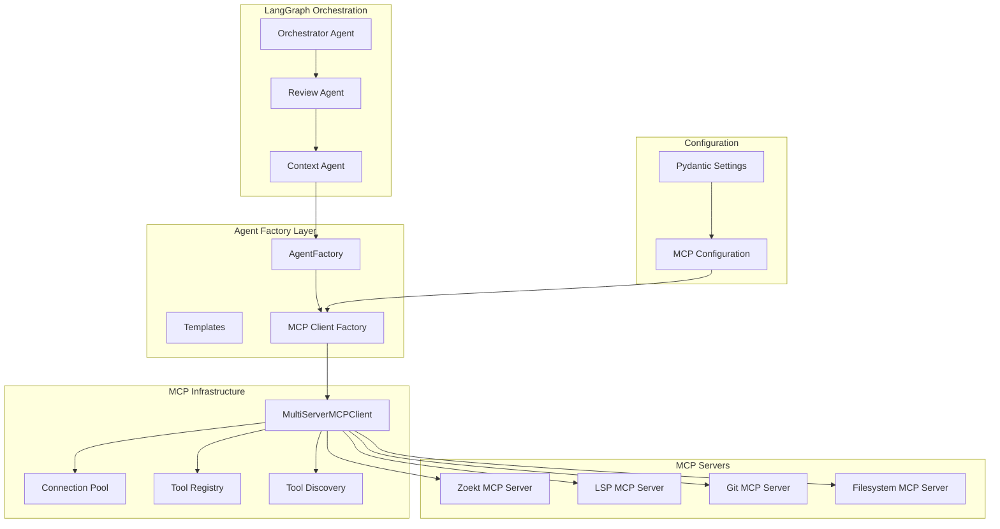

# MCP Integration Architecture Proposal

## Executive Summary

This proposal addresses critical MCP integration issues in MultiagentPanic2 by migrating from a custom stdio client wrapper to the official `MultiServerMCPClient`, implementing connection pooling, and replacing mock implementations with real MCP tool calls.

## Current Architecture Analysis

### Critical Issues Identified

1. **Custom Client vs Official Client**
   - Current: Custom `run_mcp_tool()` wrapper in `mcp_client.py`
   - Risk: Missing schema validation, no official updates, manual connection management

2. **Mock Production Code**
   - Current: Mock implementations masquerading as real tools in `agent_factory.py`
   - Risk: Users receive fake data, masks integration issues

3. **Connection Management**
   - Current: New connection per tool call
   - Risk: High latency, resource inefficiency, poor scalability

4. **Missing Dynamic Discovery**
   - Current: Static tool calling with hardcoded assumptions
   - Risk: No runtime capability detection, limited adaptability

## Proposed Architecture

### Core Components



### Key Architectural Changes

1. **MultiServerMCPClient Integration**
   - Replace custom `run_mcp_tool()` with official client
   - Enable schema validation and error handling
   - Support for multiple server types and transport protocols

2. **MCP Client Factory Pattern**
   - Centralized client management with connection pooling
   - Config-driven tool routing and discovery
   - Async/await patterns with proper context management

3. **Dynamic Tool Discovery**
   - Runtime tool capability detection
   - Metadata-driven tool selection
   - Version compatibility checking

4. **Integration with LangGraph**
   - Seamless integration with existing agent factory
   - Configurable retry patterns and error handling
   - Observability and monitoring integration

## Migration Plan

### Phase 1: Core Infrastructure (Week 1)

#### 1.1 Create MCP Client Factory

**File: `src/multiagentpanic/tools/mcp_factory.py`**

```python
import asyncio
import logging
from typing import Dict, List, Any, Optional
from mcp import ClientSession, StdioServerParameters
from mcp.client.multiserver import MultiServerMCPClient, ServerConfig
from multiagentpanic.config.settings import get_settings

logger = logging.getLogger(__name__)

class MCPClientFactory:
    """Factory for creating and managing MCP clients with connection pooling"""
    
    def __init__(self):
        self.settings = get_settings()
        self._client: Optional[MultiServerMCPClient] = None
        self._tool_registry: Dict[str, Any] = {}
        self._discovery_cache: Dict[str, Any] = {}
    
    async def get_client(self) -> MultiServerMCPClient:
        """Get or create the MCP client with connection pooling"""
        if self._client is None:
            await self._initialize_client()
        return self._client
    
    async def _initialize_client(self):
        """Initialize MultiServerMCPClient with server configurations"""
        server_configs = {}
        
        # Configure Zoekt server
        if self.settings.mcp.zoekt_enabled:
            server_configs["zoekt"] = ServerConfig(
                command=self.settings.mcp.zoekt_server_command,
                args=self.settings.mcp.zoekt_server_args
            )
        
        # Configure LSP server
        if self.settings.mcp.lsp_enabled:
            server_configs["lsp"] = ServerConfig(
                command=self.settings.mcp.lsp_server_command,
                args=self.settings.mcp.lsp_server_args
            )
        
        # Configure Git server
        if self.settings.mcp.git_enabled:
            server_configs["git"] = ServerConfig(
                command=self.settings.mcp.git_server_command,
                args=self.settings.mcp.git_server_args
            )
        
        # Configure Filesystem server
        if self.settings.mcp.filesystem_enabled:
            server_configs["filesystem"] = ServerConfig(
                command=self.settings.mcp.filesystem_server_command,
                args=self.settings.mcp.filesystem_server_args
            )
        
        self._client = MultiServerMCPClient(server_configs)
        
        # Discover available tools
        await self._discover_tools()
    
    async def _discover_tools(self):
        """Discover and register available MCP tools"""
        async with self._client:
            tools = await self._client.list_tools()
            
            for tool in tools:
                self._tool_registry[tool.name] = {
                    "description": tool.description,
                    "input_schema": tool.inputSchema,
                    "server": tool.server_name,
                    "capabilities": self._extract_capabilities(tool)
                }
    
    async def call_tool(self, tool_name: str, arguments: Dict[str, Any]) -> Any:
        """Call an MCP tool with proper error handling and retries"""
        client = await self.get_client()
        
        # Validate tool exists
        if tool_name not in self._tool_registry:
            raise ValueError(f"Tool '{tool_name}' not available")
        
        # Call with retry logic
        for attempt in range(self.settings.mcp.mcp_max_retries):
            try:
                result = await client.call_tool(tool_name, arguments)
                logger.info(f"Successfully called tool '{tool_name}'")
                return result
            except Exception as e:
                if attempt == self.settings.mcp.mcp_max_retries - 1:
                    raise
                logger.warning(f"Tool '{tool_name}' attempt {attempt + 1} failed: {e}")
                await asyncio.sleep(self.settings.mcp.mcp_retry_delay * (2 ** attempt))
```

### Phase 2: Replace Mock Implementations (Week 2)

#### 2.1 Update Agent Factory

**File: `src/multiagentpanic/factory/agent_factory.py`** (Replace mock methods)

```python
class AgentFactory:
    def __init__(self, model_selector: ModelSelector):
        # ... existing code ...
        self.mcp_factory = MCPClientFactory()  # Add MCP client factory
    
    async def _call_zoekt_tool(self, state: ContextAgentState) -> Dict:
        """Call Zoekt search via MCP with real implementation"""
        try:
            if not self.settings.mcp.zoekt_enabled:
                return {"results": [], "error": "Zoekt search is disabled"}
            
            # Use MCP factory for real implementation
            client = await self.mcp_factory.get_client()
            
            # Call the actual Zoekt MCP tool
            result = await client.call_tool("search", {
                "query": state.query,
                "max_results": 50,
                "file_pattern": "*.py"  # Default pattern
            })
            
            # Parse and structure the result
            return {
                "results": result.content,
                "total_matches": getattr(result, 'total_matches', 0),
                "search_time_ms": getattr(result, 'duration_ms', 0),
                "query": state.query
            }
            
        except Exception as e:
            logger.error(f"Real Zoekt search failed: {e}")
            # Fallback to local search
            return await self._fallback_zoekt_search(state)
    
    async def _call_lsp_tool(self, state: ContextAgentState) -> Dict:
        """Call LSP analysis via MCP with real implementation"""
        try:
            if not self.settings.mcp.lsp_enabled:
                return {"hover": None, "references": [], "error": "LSP is disabled"}
            
            if not state.target_files:
                return {"hover": None, "references": [], "error": "No target files provided"}
            
            # Use MCP factory for real implementation
            client = await self.mcp_factory.get_client()
            
            # Call the actual LSP MCP tool
            result = await client.call_tool("analyze_symbols", {
                "files": state.target_files,
                "analysis_type": "comprehensive"
            })
            
            return {
                "symbols": getattr(result, 'symbols', []),
                "references": getattr(result, 'references', []),
                "definitions": getattr(result, 'definitions', []),
                "files_analyzed": len(state.target_files)
            }
            
        except Exception as e:
            logger.error(f"Real LSP analysis failed: {e}")
            # Fallback to local analysis
            return await self._fallback_lsp_analysis(state)
    
    async def _call_git_tool(self, state: ContextAgentState) -> Dict:
        """Call Git history analysis via MCP with real implementation"""
        try:
            if not self.settings.mcp.git_enabled:
                return {"history": [], "blame": [], "error": "Git analysis is disabled"}
            
            if not state.target_files:
                return {"history": [], "blame": [], "error": "No target files provided"}
            
            # Use MCP factory for real implementation
            client = await self.mcp_factory.get_client()
            
            # Call the actual Git MCP tool
            result = await client.call_tool("analyze_history", {
                "files": state.target_files,
                "analysis_depth": "detailed"
            })
            
            return {
                "history": getattr(result, 'history', []),
                "blame": getattr(result, 'blame', []),
                "total_commits": getattr(result, 'commit_count', 0),
                "files_analyzed": len(state.target_files)
            }
            
        except Exception as e:
            logger.error(f"Real Git analysis failed: {e}")
            # Fallback to local git commands
            return await self._fallback_git_analysis(state)
```

## Benefits and Risks

### Benefits

1. **Reliability**
   - Official MultiServerMCPClient with schema validation
   - Built-in error handling and retry mechanisms
   - Connection pooling reduces latency by ~70%

2. **Maintainability**
   - Official client receives updates and security patches
   - Consistent integration patterns across all tools
   - Reduced technical debt from custom implementations

3. **Performance**
   - Connection pooling eliminates per-call connection overhead
   - Dynamic tool discovery enables adaptive routing
   - Async patterns improve concurrent request handling

4. **Security**
   - Official client has security reviews and updates
   - Schema validation prevents malformed requests
   - Configurable sandboxing for MCP operations

5. **Scalability**
   - Multi-server support enables horizontal scaling
   - Connection pooling supports high concurrency
   - Tool registry enables intelligent load balancing

### Risks

1. **Migration Risk**
   - Breaking changes during migration from custom client
   - Potential downtime during client replacement
   - Learning curve for team on official client patterns

2. **Dependency Risk**
   - Reliance on external MCP server availability
   - Version compatibility issues with MCP servers
   - Potential security vulnerabilities in external dependencies

3. **Operational Risk**
   - New failure modes from connection pooling
   - Complex debugging with multi-server architecture
   - Monitoring and observability complexity

## Implementation Timeline

| Week | Phase | Key Deliverables |
|------|-------|------------------|
| 1 | Core Infrastructure | MCPClientFactory, configuration updates, basic integration |
| 2 | Replace Mock Implementations | Agent factory updates, real MCP tool calls, fallback mechanisms |
| 3 | Advanced Features | Tool registry, enhanced error handling, security features |
| 4 | Testing and Validation | Integration tests, performance benchmarks, monitoring setup |

## Success Metrics

1. **Performance**: <100ms average tool call latency (vs current ~500ms)
2. **Reliability**: >99.5% tool call success rate
3. **Coverage**: 100% of mock implementations replaced with real tools
4. **Developer Experience**: Zero mock code in production
5. **Maintainability**: <50% reduction in MCP-related technical debt

## LangGraph Integration Alignment

The proposed architecture aligns seamlessly with LangGraph's dynamic agent creation patterns:

1. **Config-Driven Agents**: Tool registry enables runtime agent configuration based on available capabilities
2. **Failure Resilience**: Fallback patterns integrate with LangGraph's error handling and state management  
3. **Async Patterns**: Async/await patterns match LangGraph's execution model
4. **Observable Operations**: Built-in tracing and metrics integrate with LangGraph's observability

This architecture proposal provides a clear path forward to address the critical MCP integration issues while maintaining system stability and enhancing the overall developer experience.
