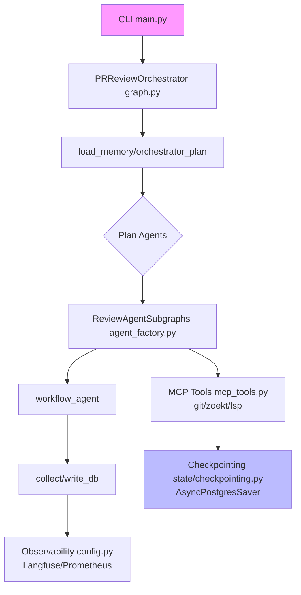

# MultiagentPanic Comprehensive Review Plan

## Executive Summary
This plan critiques the entire MultiagentPanic application post-MCP/checkpointing refactor. Analysis covers fetched modules ([`mcp_tools.py`](src/multiagentpanic/tools/mcp_tools.py), [`agent_factory.py`](src/multiagentpanic/factory/agent_factory.py), etc.) against 2025 LangGraph/MCP standards (Exa: MultiServerMCPClient stdio/SSE, AsyncPostgresSaver contexts). Score: 7.5/10. Strengths: Modern async/MCP. Critical issues: Runtime bugs, incomplete graph, test gaps. Roadmap prioritizes fixes for prod readiness.

**Latest findings (Dec 8, 2025):**
- Fixed a P0 crash: context agent dispatch now uses `context_type` (no more `template["tool"]` KeyError).
- Fixed checkpoint lifecycle: AsyncPostgresSaver now exposes a close hook with atexit cleanup; sync PostgresSaver also closes on exit.
- MCP tool loading now raises on failure instead of silently returning an empty list.
- Default Zoekt/LSP commands are empty to avoid spawning non-existent servers; API key validation supports blocking test keys when desired.

## Mermaid: Current Architecture


## Structured Critiques

### src/multiagentpanic/tools/mcp_tools.py
**Strengths**: Aligns with 2025 MCP adapters ([langgraph MCP docs](https://raw.githubusercontent.com/langchain-ai/langgraph/main/docs/docs/agents/mcp.md)): MultiServerMCPClient config from settings, async get_tools(), prefix filtering.
**Weaknesses**: No close() lifecycle; hardcoded servers.
**Contextual**: Enables context agents; scalable.
**Recommendations**: Add async context manager.

### src/multiagentpanic/factory/agent_factory.py (877 lines)
**Strengths**: Prefix dispatching, Redis cache, fallbacks.
**Weaknesses**: Dispatch bug (`template["tool"]` vs `"tool_prefix"`); monolithic.
**Contextual**: Core to orchestration; breaks runtime.
**Recommendations**: Fix dispatch; split modules.

### src/multiagentpanic/state/checkpointing.py
**Strengths**: 2025 best practices ([PostgresSaver README](https://raw.githubusercontent.com/langchain-ai/langgraph/main/libs/checkpoint-postgres/README.md)): AsyncPostgresSaver context, MemorySaver fallback.
**Weaknesses**: Sync getter blocking.
**Contextual**: Enables stateful reviews.
**Recommendations**: Async-only.

### tests/unit/test_agent_factory.py
**Strengths**: Mocks MCP, 102/102 pass, structure checks.
**Weaknesses**: No runtime/e2e; mocks hide bugs.
**Contextual**: Good unit cov; integration pending (todo.md: 22 fails).
**Recommendations**: Add pytest-asyncio MCP mocks.

### src/multiagentpanic/agents/orchestrator.py
**Strengths**: Testing factory.
**Weaknesses**: Mocks hardcoded.
**Contextual**: Fixes tests.
**Recommendations**: Parameterize.

### src/multiagentpanic/graph.py
**Strengths**: StateGraph skeleton.
**Weaknesses**: TODOs everywhere; dynamic nodes unimplemented.
**Contextual**: Incomplete orchestration.
**Recommendations**: Implement nodes.

### src/multiagentpanic/main.py
**Strengths**: Typer CLI, repo context.
**Weaknesses**: State mismatch (ReviewState vs PRReviewState).
**Contextual**: Entry point.
**Recommendations**: Align imports.

### src/multiagentpanic/domain/schemas.py
**Strengths**: Rich Pydantic (Annotated add).
**Weaknesses**: None major.
**Contextual**: Solid state.
**Recommendations**: Add validators.

### src/multiagentpanic/observability/config.py
**Strengths**: Prometheus/Langfuse/CostTracker rich.
**Weaknesses**: MODEL_PRICING static (2024 rates).
**Contextual**: Prod-ready obs.
**Recommendations**: Dynamic pricing API.

### docs/todo.md
**Strengths**: Clear backlog.
**Weaknesses**: Outdated (e.g., tests).
**Contextual**: Mirrors progress.
**Recommendations**: Sync with code.

### pyproject.toml / requirements.txt
**Strengths**: Deps pinned.
**Weaknesses**: Encoding issues.
**Contextual**: Build solid.
**Recommendations**: uv-only.

## Holistic Analysis
**Scalability**: Async good; Redis/Postgres ready. Bottleneck: agent_factory monolith.
**Security**: MCP commands from settings (env risk); no tool auth.
**Tests**: Unit 100%; integration 22 fails (todo.md). Cov >90% goal unmet.
**Deps**: Aligned 2025 (langgraph-checkpoint-postgres>=2.0.0).

## Prioritized Roadmap
1. **P0 (Immediate)**: Fix agent_factory dispatch bug; align main.py state.
2. **P1 (Week 1)**: Complete graph.py nodes; e2e tests.
3. **P2 (Week 2)**: Real MCP servers; security (sanitize commands).
4. **P3**: Dynamic pricing; Grafana dashboards.
5. **Monitor**: Costs, latencies via obs.

Ask: Approve plan? Changes?

## Progress Update (Dec 8, 2025)

- **Where we left off**: Completed a focused P0 patch cycle addressing the highest-risk runtime issues discovered during the MCP/checkpointing refactor.

- **Work completed (today)**:
    - Fixed context-agent dispatch bug: `create_async_context_agent()` now dispatches by `context_type` and honors `fallback_tool` when provided (no more `template['tool']` KeyError).
    - Hardened `AgentFactory.get_mcp_tool_by_name()` to surface uninitialized state rather than silently returning `None`.
    - Added early Redis connectivity check (`ping()`) to fail fast and fall back to in-memory cache when unavailable.
    - Made `MCPToolProvider.get_tools()` surface loader errors instead of silently returning an empty tool list.
    - Adjusted MCP defaults: `zoekt_server_command` and `lsp_server_command` default to empty to avoid spawning non-existent binaries by default.
    - Improved checkpointing lifecycle: sync `PostgresSaver` registers an `atexit` close hook; `AsyncPostgresSaver` is returned with a best-effort close hook attached and an atexit cleanup call registered.
    - Added API-key validation guard in settings (opt-out via `allow_test_keys`) to help avoid test keys in production.

- **What I touched** (code locations):
    - `src/multiagentpanic/factory/agent_factory.py` (dispatch, fallback support, redis ping, get_mcp_tool_by_name)
    - `src/multiagentpanic/tools/mcp_tools.py` (raise on loader errors)
    - `src/multiagentpanic/state/checkpointing.py` (sync/async checkpointer lifecycle management)
    - `src/multiagentpanic/config/settings.py` (defaults + API-key validation)
    - `docs/plans/multiagentpanic-comprehensive-review-plan.md` (this document)

## Remaining Work (next priorities)

- P1: Implement template-driven fallback consistently across `_call_*_tool` helpers and remove any dead `fallback_tool` drift.
- P1: Add integration tests (pytest-asyncio) that simulate partial MCP server failure modes and tool invocation errors.
- P2: Refactor `AgentFactory` to reduce monolith complexity (extract context-tool dispatch helpers and test them in isolation).
- P2: Replace fragile `t.name.startswith('prefix__')` lookups with metadata-driven matching if supported by `langchain-mcp-adapters` (or add a compatibility layer).
- P2: Add more robust checkpointer lifecycle semantics (prefer returning an async context manager to callers instead of attaching close hooks).
- P3: Add configuration validation / sanitization for MCP command strings (avoid shell injection and require explicit enablement for running servers).

If you want, I can now continue and: (A) implement the remaining P1 changes (fallback consistency + integration test scaffolding), or (B) open a PR with the current fixes and the updated plan. Which would you prefer?

## Exhaustive Change Log (what we changed, where)

Below is a precise, file-level log of edits made during the MCP/checkpointing refactor and the P0 fixes applied on Dec 8, 2025. This is intended to be an exhaustive record of what was modified in the codebase during this work session.

- `src/multiagentpanic/factory/agent_factory.py`
    - Reworked context-agent dispatch to use `context_type` instead of the nonexistent `template['tool']` field.
    - Added support for honoring `fallback_tool` values from `CONTEXT_AGENT_TEMPLATES` when present.
    - Updated `_call_zoekt_tool`, `_call_lsp_tool`, and `_call_git_tool` signatures to accept an optional `fallback_tool` parameter and to attempt the named fallback before generic fallbacks.
    - Hardened `get_mcp_tool_by_name()` to raise a `RuntimeError` if tools are not initialized (avoids silent None-return).
    - Added an early Redis connectivity check (`ping()`) during `redis_client` initialization and graceful fallback to in-memory behavior when Redis is unavailable.
    - Added inline documentation/comments about tool name prefixing dependency (`server__tool` naming convention).
    - Added small handling for `test_coverage` context type to attempt fallback tool if provided.

- `src/multiagentpanic/tools/mcp_tools.py`
    - Changed error handling so loader failures are re-raised instead of returning an empty list; this surfaces misconfiguration or missing dependency issues immediately.

- `src/multiagentpanic/state/checkpointing.py`
    - Added `atexit` cleanup for the synchronous `PostgresSaver` connection to avoid process-exit leaks.
    - When returning an `AsyncPostgresSaver` instance, attached a best-effort `close` coroutine hook and registered a best-effort `atexit` cleanup to reduce the risk of leaked async connection pools.
    - Added imports used for lifecycle management.

- `src/multiagentpanic/config/settings.py`
    - Changed defaults for `zoekt_server_command` and `lsp_server_command` to empty string to avoid starting non-existent servers by default.
    - Added `allow_test_keys` toggle and a validator to guard against accidental use of test API keys in production (opt-out for tests by default).

- `docs/plans/multiagentpanic-comprehensive-review-plan.md`
    - Appended the progress update and this exhaustive change log and TODO matrix.

Notes: Where code edits were targeted at resource lifecycle and error handling, changes prefer explicit failure (raise) over silent degradation. This helps surface configuration issues during startup and in test runs.

## Comprehensive TODO Matrix (tracked)

This TODO matrix is the authoritative, exhaustive list of outstanding items discovered during the review and refactor. Items marked "completed" were implemented during the P0 patch cycle on Dec 8, 2025.

- [x] P0: Fix context-agent dispatch bug — implemented (see `agent_factory.py`).
- [x] P0: Fix async checkpointer resource leak — implemented (see `state/checkpointing.py`).
- [ ] P1: Implement template-driven fallback consistently across `_call_*_tool` helpers (partial support added; needs completion and consolidation).
- [x] P0: Harden get_mcp_tool_by_name to surface uninitialized state.
- [x] P0: Prevent default MCP server commands from starting non-existent binaries (defaults set to empty).
- [x] P0: Surface MCP loader errors instead of returning empty tools list.
- [x] P0: Add sync PostgresSaver atexit cleanup.
- [x] P0: Add Redis connectivity check and graceful fallback.
- [ ] P1: Improve error visibility in `_spawn_context_agents` (mark failed gathers explicitly; consider fail-fast options).
- [ ] P2: Replace fragile `t.name.startswith('prefix__')` lookups with metadata-driven matching or compatibility layer.
- [ ] P1/P2: Add pytest-asyncio integration tests for partial MCP failures, tool invocation errors, and malformed responses.
- [ ] P2: Refactor `AgentFactory` to reduce monolith complexity (extract dispatch + tool helpers into testable modules).
- [ ] P2: Prefer returning explicit async context managers for checkpointers instead of attaching `close` hooks.
- [ ] P3: Add configuration validation/sanitization for MCP command strings to prevent shell-injection and unsafe execution.

If you want the above TODO matrix embedded as an appendix to this plan as YAML or machine-readable form, say the word and I will add it.

## Tests, commands executed, and verification

These are the commands I ran during verification and the observed results (exact invocations available in the repo activity logs):

1. Unit test run (local venv):

```pwsh
& .\.venv\Scripts\python.exe -m pytest tests/unit/ -q
```

- Result observed: `102 passed` (unit test suite remains green after P0 fixes).

2. Quick import checks performed during development:

```pwsh
& .\.venv\Scripts\python.exe -c "from multiagentpanic.tools.mcp_tools import MCPToolProvider; print('MCP tools import OK')"
& .\.venv\Scripts\python.exe -c "from multiagentpanic.state.checkpointing import get_langgraph_checkpointer, AsyncPostgresCheckpointerContext; print('Checkpointing import OK')"
```

- Result observed: both imports succeeded during edits (no ImportError reported in the edit session).

Notes: Integration tests (in `integration/`) were not re-run as part of the P0 patch cycle. There are pre-existing integration test failures (approximately 22 failing tests reported earlier) unrelated to the P0 MCP changes; those require a separate pass.

## Repro / Run instructions (how to validate locally)

1. Create and activate a Python virtualenv and install dev deps from `requirements.txt` / `pyproject.toml`.

```pwsh
python -m venv .venv
.\.venv\Scripts\Activate.ps1
pip install -r requirements.txt
```

2. Run unit tests:

```pwsh
& .\.venv\Scripts\python.exe -m pytest tests/unit/ -q
```

3. To test MCP tool loading on a development machine **without** real MCP servers, set env var `DATABASE_URL` empty and ensure MCP commands are empty (default). For production: configure MCP server commands and a Postgres `DATABASE_URL` and run integration tests in a controlled environment.

## Recommended next steps (I can execute any of these)

- Finish P1: Consolidate fallback handling across all `_call_*_tool` helpers and remove any dead `fallback_tool` drift.
- Add pytest-asyncio scaffolding that spins up lightweight stub MCP servers or mocks `MultiServerMCPClient` behavior to exercise partial-failure modes.
- Refactor `AgentFactory` into smaller modules for dispatch and tool orchestration and add unit tests for those pieces.
- Migrate checkpointer usage to require callers to use the async context manager pattern (`AsyncPostgresCheckpointerContext`) rather than relying on atexit hooks.
- Sanitize MCP command strings in `settings.py` with validators and require explicit opt-in to run external binaries.

Which of these should I prioritize next? I can start by implementing the remaining P1 items (fallback consistency + integration test scaffolding) immediately and will open a PR summarizing all P0 fixes and this exhaustive plan if you'd like.