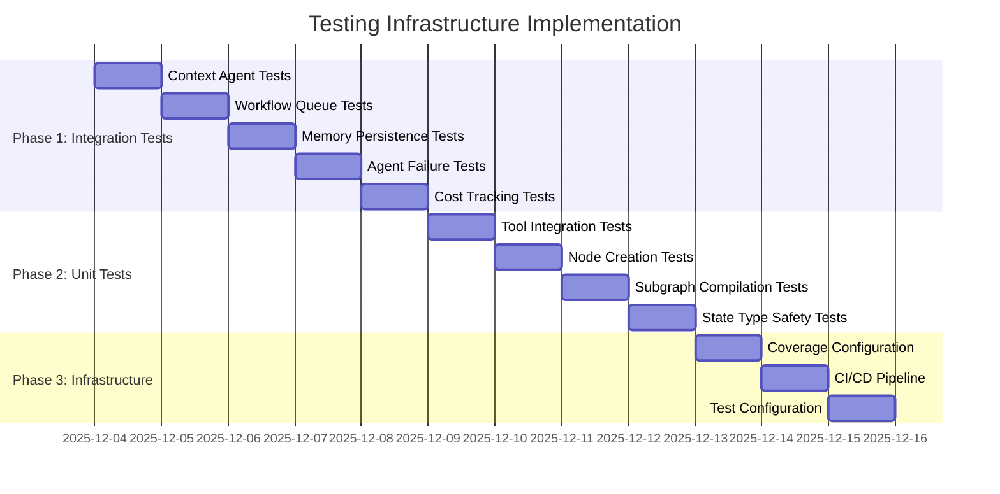

# MultiagentPanic Testing Infrastructure Plan

## Executive Summary

This plan outlines the comprehensive testing infrastructure required for the MultiagentPanic project, addressing the gaps between current implementation and documented requirements.

## Current State Analysis

### Existing Testing Infrastructure

**Files and Structure:**
- `tests/integration/test_orchestrator.py` - 2 basic integration tests
- `tests/unit/` - Empty directory (no unit tests implemented)
- `tests/dummy_repo/` - Test data structure
- No CI/CD configuration files
- No test coverage measurement
- No conftest.py or shared fixtures

**Current Test Coverage:**
- 2/7 planned integration tests implemented
- 0/4 planned unit test categories implemented
- No coverage measurement
- No CI/CD pipeline
- Basic mocking strategy (LLM calls only)

### Documentation Requirements Analysis

**From docs/guides/testing.md:**
- 7 E2E integration tests required
- 4 unit test categories required (tool integration, node creation, subgraph compilation, state type safety)
- Inverted test pyramid approach
- Real LLM calls with budget tracking
- CI/CD configuration with GitHub Actions
- Test fixtures for different PR types
- Coverage measurement with pytest-cov

**From docs/todo.md:**
- "Set up integration test framework" - Active task
- "Configure observability stack" - Active task (related to testing)

## Gap Analysis

### Major Gaps Identified

1. **Missing 5 of 7 Integration Tests**
   - Missing: context agent spawning, workflow queue deduplication, memory persistence, agent failure recovery, cost tracking accuracy
   - Only implemented: simple PR review, complex multi-round review

2. **No Unit Tests**
   - No factory unit tests (tool integration, node creation, subgraph compilation)
   - No state type safety tests
   - Empty unit/ directory

3. **Missing Test Infrastructure**
   - No pytest-cov configuration
   - No conftest.py with shared fixtures
   - No CI/CD pipeline configuration
   - No test budget tracking implementation

4. **Limited Mocking Strategy**
   - Only basic LLM mocking
   - No fixtures for different PR types (simple, complex, context-heavy, etc.)
   - No mocking for agent failures or edge cases

5. **No Quality Assurance Tools**
   - No coverage thresholds defined
   - No test timeout management
   - No test result reporting

## Proposed Testing Architecture

### Test Pyramid Structure

```mermaid
graph TD
    A[Integration Tests (7 E2E)] -->|Real LLM, Real Workflow| B[Factory Unit Tests]
    B -->|No LLM, Test Foundations| C[State Type Safety Tests]
    C -->|Pydantic Validation| D[Test Infrastructure]
    D -->|Coverage, CI/CD, Fixtures| E[Quality Assurance]
```

### Implementation Roadmap

#### Phase 1: Integration Test Suite (Priority 1 - 3 days)

**Objective:** Implement missing 5 integration tests per documentation

**Tasks:**
1. **Test 3: Context Agent Spawning**
   - Create fixture for context-heavy PR
   - Implement Zoekt/LSP/Git context verification
   - Add context influence validation

2. **Test 4: Workflow Queue Deduplication**
   - Create CI-required PR fixture
   - Implement workflow queue mocking
   - Add deduplication verification logic

3. **Test 5: Memory Persistence**
   - Create similar PRs fixture
   - Implement memory system mocking
   - Add learning verification across reviews

4. **Test 6: Agent Failure Recovery**
   - Create agent failure injection mechanism
   - Implement error recording verification
   - Add graceful degradation testing

5. **Test 7: Cost Tracking Accuracy**
   - Implement Langfuse client mocking
   - Add cost calculation verification
   - Create token counting validation

**Deliverables:**
- 5 new integration test files
- Comprehensive test fixtures
- Budget tracking implementation

#### Phase 2: Unit Test Suite (Priority 2 - 2 days)

**Objective:** Create comprehensive unit test coverage

**Tasks:**
1. **Tool Integration Tests**
   - MCP tool binding verification
   - Schema validation tests
   - Error handling for unknown tools

2. **Node Creation Tests**
   - Template-based node creation
   - Retry wrapper verification
   - Tracing wrapper validation

3. **Subgraph Compilation Tests**
   - Review agent compilation
   - Context agent compilation
   - Graph connectivity verification

4. **State Type Safety Tests**
   - Pydantic model validation
   - State operator merging
   - Serialization roundtrip testing

**Deliverables:**
- 4 unit test files (one per category)
- Mock state implementations
- Test templates and patterns

#### Phase 3: Test Infrastructure (Priority 3 - 2 days)

**Objective:** Add supporting test infrastructure

**Tasks:**
1. **Coverage Measurement**
   - Add pytest-cov configuration
   - Set coverage thresholds (80% integration, 95% unit)
   - Implement coverage reporting

2. **CI/CD Pipeline**
   - Create GitHub Actions workflow
   - Separate unit and integration test jobs
   - Add test budget enforcement

3. **Test Configuration**
   - Create conftest.py with shared fixtures
   - Implement test settings management
   - Add cost tracking fixtures

4. **Quality Assurance**
   - Add test timeout management
   - Implement test result reporting
   - Create test documentation

**Deliverables:**
- `.github/workflows/test.yml`
- `conftest.py` with fixtures
- `pytest.ini` configuration
- Updated documentation

## Tools and Technologies

### Test Framework
- **Primary:** pytest
- **Coverage:** pytest-cov
- **Mocking:** unittest.mock, pytest-mock
- **CI/CD:** GitHub Actions
- **Test Data:** Fixtures with parametrization
- **Configuration:** conftest.py with pytest fixtures

### Test Data Requirements
- Simple PR fixture (1 file, obvious issue)
- Complex PR fixture (5+ files, requires healing)
- Context-heavy PR fixture (requires code search)
- CI-required PR fixture (multiple agents want CI)
- Similar PRs fixture (for memory testing)
- Agent failure scenarios

## Success Criteria

### Integration Tests
| Test | Pass Criteria | Timeout |
|------|---------------|---------|
| `test_simple_pr_review_e2e` | Completes Round 1, finds ≥1 issue, all agents ran | 5 min |
| `test_complex_multi_round_review` | Reaches Round 2+, no unresolved critical issues | 10 min |
| `test_context_agent_spawning` | Context gathered, findings include code snippets | 5 min |
| `test_workflow_queue_deduplication` | Multiple requests → 1 CI run | 5 min |
| `test_memory_persistence` | Second review finds similar issues | 10 min |
| `test_agent_failure_recovery` | Review completes, error recorded, other agents succeed | 5 min |
| `test_cost_tracking_accuracy` | Cost within 5% of Langfuse traces | 5 min |

### Unit Tests
| Test Category | Pass Criteria |
|---------------|---------------|
| Tool Integration | All tools bind, schemas valid, errors raised for unknown |
| Node Creation | Nodes callable, wrappers applied |
| Subgraph Compilation | Graphs compile, checkpointing correct, edges connected |
| State Type Safety | Validation works, operators merge correctly, roundtrip succeeds |

## Implementation Timeline



## Budget and Resource Requirements

### Test Budget
- **Per Integration Test:** $1.00 max
- **Total Test Budget:** $10.00
- **Model Selection:** Claude 3 Haiku (cheapest suitable model)

### Development Resources
- **Time Estimate:** 7-10 days total
- **Priority:** High (blocking production deployment)
- **Dependencies:** None (can be developed in parallel)

## Risk Assessment

### High Risks
- **LLM Cost Overruns:** Mitigate with strict budget tracking and test timeouts
- **Flaky Tests:** Mitigate with deterministic seeding and retry logic
- **Complex Setup:** Mitigate with comprehensive fixtures and documentation

### Medium Risks
- **Test Maintenance:** Mitigate with clear documentation and fixture patterns
- **Performance Issues:** Mitigate with timeout management and parallelization

## Next Steps

1. **Immediate:** Begin Phase 1 - Integration Test Implementation
2. **Parallel:** Set up basic test infrastructure (conftest.py, pytest.ini)
3. **Documentation:** Update docs/guides/testing.md with implementation details
4. **Review:** Schedule architecture review after Phase 1 completion

## Approval Required

This plan requires review and approval before implementation begins. The proposed architecture aligns with the documented requirements in `docs/guides/testing.md` and addresses all identified gaps while maintaining the inverted test pyramid philosophy appropriate for LLM-based systems.