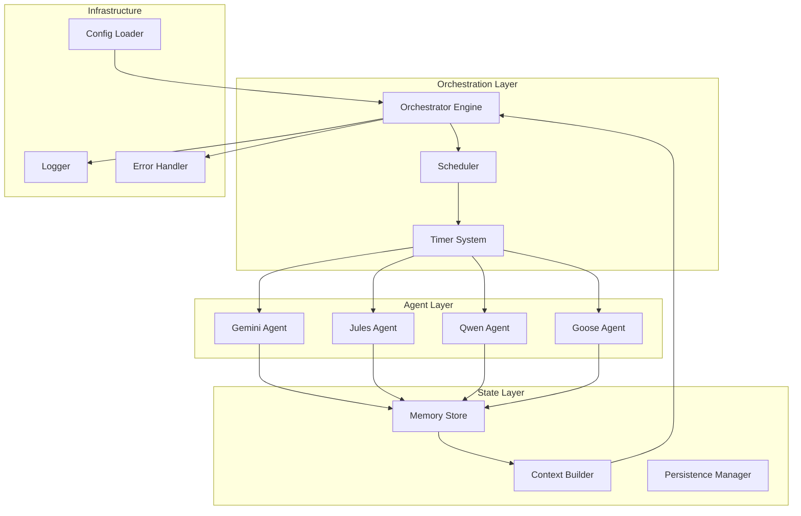

# Agent Council - System Architecture

## Table of Contents
1. [System Overview](#system-overview)
2. [Core Components](#core-components)
3. [Agent Architecture](#agent-architecture)
4. [State Management](#state-management)
5. [Scheduling System](#scheduling-system)
6. [Context Sharing](#context-sharing)
7. [Error Handling](#error-handling)
8. [Logging Architecture](#logging-architecture)
9. [Security Considerations](#security-considerations)
10. [Performance Optimization](#performance-optimization)

## System Overview

Agent Council is a Python-based orchestration system that coordinates multiple AI CLI tools to work together autonomously. The system operates on a timer-based scheduling mechanism with persistent state management.

### Design Principles

1. **Simplicity**: No complex frameworks, just timers and process management
2. **Resilience**: Graceful failure handling with automatic recovery
3. **Modularity**: Each agent is independent and replaceable
4. **Observability**: Comprehensive logging for debugging and monitoring
5. **Persistence**: State survives restarts and failures
6. **Autonomy**: Minimal human intervention required

### High-Level Architecture



## Core Components

### 1. Orchestrator Engine (`src/orchestrator.py`)

The central coordination component that manages the entire system lifecycle.

```python
class AgentCouncilOrchestrator:
    """Main orchestration engine for Agent Council"""

    def __init__(self):
        self.agents = {}          # Registered agents
        self.scheduler = None     # Scheduling system
        self.memory = None        # State management
        self.logger = None        # Logging system
        self.running = False      # Orchestrator state

    async def initialize(self):
        """Initialize all subsystems"""
        # Load configuration
        # Initialize agents
        # Set up scheduler
        # Load previous state

    async def run(self):
        """Main orchestration loop"""
        # Check agent timers
        # Execute due agents
        # Update state
        # Handle errors

    async def shutdown(self):
        """Graceful shutdown"""
        # Save state
        # Close connections
        # Clean up resources
```

### 2. Agent Base Class (`src/agents/base_agent.py`)

Abstract base class that all agents inherit from:

```python
class BaseAgent(ABC):
    """Abstract base class for all agents"""

    def __init__(self, name: str, config: dict):
        self.name = name
        self.config = config
        self.last_run = None
        self.run_count = 0
        self.failures = 0

    @abstractmethod
    async def execute(self, prompt: str, context: dict) -> dict:
        """Execute agent with given prompt and context"""
        pass

    @abstractmethod
    def parse_response(self, response: str) -> dict:
        """Parse agent-specific response format"""
        pass

    async def run_command(self, cmd: list) -> str:
        """Execute CLI command and capture output"""
        pass
```

### 3. Scheduler (`src/scheduler/round_robin.py`)

Timer-based round-robin scheduling system:

```python
class RoundRobinScheduler:
    """Round-robin scheduler with timer support"""

    def __init__(self):
        self.agents = []
        self.timers = {}
        self.current_index = 0

    def add_agent(self, agent: BaseAgent, interval: int):
        """Register agent with execution interval"""
        self.agents.append(agent)
        self.timers[agent.name] = {
            'interval': interval,
            'last_run': 0,
            'next_run': time.time() + interval
        }

    def get_ready_agents(self) -> List[BaseAgent]:
        """Get agents ready for execution"""
        current_time = time.time()
        ready = []

        for agent in self.agents:
            if self.timers[agent.name]['next_run'] <= current_time:
                ready.append(agent)

        return ready
```

## Agent Architecture

### Agent Specifications

Each agent has specific roles and capabilities:

#### Gemini Agent - Project Reviewer
- **Schedule**: Every 10 minutes
- **Role**: Review progress, architectural decisions, suggest next steps
- **Mode**: Headless, non-interactive (`-y` flag)
- **Output**: Structured JSON with recommendations

#### Jules Agent - Developer
- **Schedule**: Every 60 minutes
- **Role**: Execute development tasks, write code
- **Batch**: 3 tasks per execution
- **Integration**: Web-based task submission

#### Qwen Agent - Analyst
- **Schedule**: Every 30 minutes
- **Role**: Code analysis, quality checks, documentation
- **Mode**: Analysis mode with JSON output
- **Focus**: Code improvements, refactoring suggestions

#### Goose Agent - Executor
- **Schedule**: Every 15 minutes
- **Role**: Run commands, tests, deployments
- **Mode**: Command execution mode
- **Tasks**: Build, test, deploy operations

### Agent Communication Protocol

Agents communicate through structured messages:

```json
{
    "timestamp": "2024-01-01T10:00:00Z",
    "from_agent": "gemini",
    "to_agent": "jules",
    "message_type": "task_request",
    "payload": {
        "priority": "high",
        "task": "Implement error handling in orchestrator.py",
        "context": {
            "recent_errors": [...],
            "suggested_approach": "..."
        }
    }
}
```

## State Management

### Persistent Memory System

The state management system maintains context across executions:

```python
class PersistentMemory:
    """Persistent state management"""

    def __init__(self, storage_path: str):
        self.storage_path = storage_path
        self.memory = self._load_state()

    def store_interaction(self, agent: str, interaction: dict):
        """Store agent interaction"""
        entry = {
            'timestamp': datetime.now().isoformat(),
            'agent': agent,
            'input': interaction.get('input'),
            'output': interaction.get('output'),
            'status': interaction.get('status'),
            'duration': interaction.get('duration')
        }
        self.memory['interactions'].append(entry)
        self._save_state()

    def get_context(self, hours: int = 24) -> dict:
        """Build context from recent interactions"""
        cutoff = datetime.now() - timedelta(hours=hours)
        recent = [i for i in self.memory['interactions']
                  if datetime.fromisoformat(i['timestamp']) > cutoff]
        return self._build_context(recent)
```

### State File Structure

```json
{
    "version": "1.0.0",
    "created": "2024-01-01T00:00:00Z",
    "last_updated": "2024-01-01T10:00:00Z",
    "agents": {
        "gemini": {
            "last_run": "2024-01-01T10:00:00Z",
            "run_count": 144,
            "total_failures": 2,
            "status": "active"
        }
    },
    "project_state": {
        "current_phase": "development",
        "completed_tasks": [...],
        "pending_tasks": [...],
        "blockers": [...]
    },
    "interactions": [...]
}
```

## Scheduling System

### Timer-Based Execution

The system uses simple timer-based scheduling:

```python
class TimerSystem:
    """Simple timer-based scheduling"""

    async def run(self):
        """Main timer loop"""
        while self.running:
            # Check all agent timers
            ready_agents = self.scheduler.get_ready_agents()

            # Execute ready agents concurrently
            tasks = []
            for agent in ready_agents:
                task = asyncio.create_task(self.execute_agent(agent))
                tasks.append(task)

            # Wait for all to complete
            if tasks:
                await asyncio.gather(*tasks, return_exceptions=True)

            # Sleep for minimum check interval (30 seconds)
            await asyncio.sleep(30)
```

### Scheduling Configuration

```yaml
# config/agents.yaml
scheduling:
  min_check_interval: 30  # Minimum seconds between timer checks
  max_concurrent: 4        # Maximum concurrent agent executions

agents:
  gemini:
    interval: 600         # 10 minutes
    timeout: 120          # 2 minute timeout
    retry_delay: 60       # 1 minute retry delay
    max_retries: 3
```

## Context Sharing

### Context Building Strategy

Context is built from recent agent interactions:

```python
class ContextBuilder:
    """Build shared context for agents"""

    def build_context(self, target_agent: str) -> dict:
        """Build context for specific agent"""

        context = {
            'timestamp': datetime.now().isoformat(),
            'target_agent': target_agent,
            'recent_interactions': self._get_recent_interactions(),
            'project_state': self._get_project_state(),
            'agent_outputs': self._get_agent_outputs(),
            'pending_tasks': self._get_pending_tasks(),
            'errors': self._get_recent_errors()
        }

        # Agent-specific context
        if target_agent == 'gemini':
            context['review_focus'] = self._get_review_priorities()
        elif target_agent == 'jules':
            context['development_tasks'] = self._get_dev_tasks()
        elif target_agent == 'qwen':
            context['analysis_targets'] = self._get_analysis_targets()
        elif target_agent == 'goose':
            context['execution_queue'] = self._get_execution_queue()

        return context
```

### Context Propagation Flow

```
Gemini (Review) → Context Update → Jules (Development)
       ↓                                    ↓
    Context                             Context
       ↓                                    ↓
Qwen (Analysis) ← Context Update ← Goose (Execution)
```

## Error Handling

### Multi-Level Error Recovery

```python
class ErrorHandler:
    """Comprehensive error handling"""

    async def handle_agent_error(self, agent: str, error: Exception):
        """Handle agent execution errors"""

        # Log error
        self.logger.error(f"Agent {agent} failed: {error}")

        # Determine error severity
        severity = self._classify_error(error)

        if severity == 'critical':
            # Notify and halt agent
            await self._handle_critical_error(agent, error)
        elif severity == 'recoverable':
            # Retry with exponential backoff
            await self._schedule_retry(agent, error)
        else:
            # Log and continue
            await self._log_warning(agent, error)

    async def _schedule_retry(self, agent: str, error: Exception):
        """Schedule agent retry with backoff"""
        retry_count = self.retry_counts.get(agent, 0)

        if retry_count < self.max_retries:
            delay = self.base_delay * (2 ** retry_count)
            await asyncio.sleep(delay)
            await self.orchestrator.execute_agent(agent)
            self.retry_counts[agent] = retry_count + 1
        else:
            await self._handle_max_retries(agent, error)
```

### Error Categories

1. **Critical Errors**: System failures, missing dependencies
2. **Recoverable Errors**: API timeouts, temporary failures
3. **Warnings**: Non-blocking issues, degraded performance

## Logging Architecture

### Structured JSON Logging

```python
class StructuredLogger:
    """JSON-structured logging system"""

    def log_interaction(self, level: str, event: dict):
        """Log structured event"""

        log_entry = {
            'timestamp': datetime.now().isoformat(),
            'level': level,
            'event': event,
            'system': {
                'memory_usage': self._get_memory_usage(),
                'cpu_usage': self._get_cpu_usage(),
                'active_agents': self._get_active_agents()
            }
        }

        # Write to appropriate log file
        log_path = self._get_log_path(event.get('agent'))
        with open(log_path, 'a') as f:
            f.write(json.dumps(log_entry) + '\n')
```

### Log Directory Structure

```
data/logs/
├── orchestrator/
│   └── 2024-01-01.jsonl
├── gemini/
│   └── 2024-01-01.jsonl
├── jules/
│   └── 2024-01-01.jsonl
├── qwen/
│   └── 2024-01-01.jsonl
├── goose/
│   └── 2024-01-01.jsonl
└── errors/
    └── 2024-01-01.jsonl
```

## Security Considerations

### API Key Management

- Store API keys in environment variables
- Never commit secrets to git
- Use `.env` file for local development
- Rotate keys regularly

### Process Isolation

- Run each agent in subprocess
- Limit resource usage per agent
- Implement timeout mechanisms
- Sanitize agent outputs

### Data Protection

- Encrypt sensitive state data
- Implement access controls
- Regular backups of state
- Audit logging for security events

## Performance Optimization

### Resource Management

```python
class ResourceManager:
    """Manage system resources"""

    def check_resources(self) -> bool:
        """Check if resources are available"""

        # Memory check
        memory = psutil.virtual_memory()
        if memory.percent > 90:
            self.logger.warning("High memory usage")
            return False

        # CPU check
        cpu = psutil.cpu_percent(interval=1)
        if cpu > 80:
            self.logger.warning("High CPU usage")
            return False

        return True
```

### Optimization Strategies

1. **Concurrent Execution**: Run independent agents in parallel
2. **Caching**: Cache frequently used context data
3. **Batch Processing**: Group similar operations
4. **Resource Limits**: Set memory/CPU limits per agent
5. **Connection Pooling**: Reuse connections where possible

### Performance Metrics

- Agent execution time
- Memory usage per agent
- Context building time
- State persistence latency
- Error recovery time

## Deployment Considerations

### Platform-Specific Optimizations

#### Linux
- Use systemd for process management
- Leverage cron for backup scheduling
- Unix sockets for IPC
- Native shell scripts for system tasks

#### Windows
- Windows Task Scheduler integration
- PowerShell for system operations
- Named pipes for IPC
- Windows Service wrapper option

### Scalability Path

1. **Single Machine**: Current architecture
2. **Distributed**: Agent distribution across machines
3. **Cloud Native**: Kubernetes deployment
4. **Serverless**: Function-based agents

---

This architecture provides a robust, maintainable, and scalable foundation for the Agent Council orchestration system.